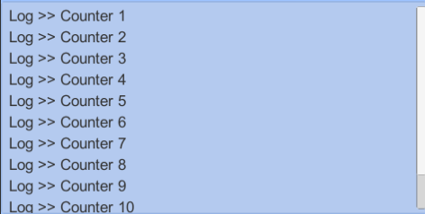

# Intro

When you working on your game, you mostly also want to debug, know the process of your game, take a look at the log you create for that game. It's easy to take a look at the log in the game engine or framework, but how if I wanna look the log from the game when it's already became executable files e.g .exe, .apk etc. 

In Android you can open terminal and show the log cat but the experience is painfull since it show all the log from your android device too, or you can open android studio and take a look at the log cat there, but sometimes we does not need all the log from our device. We only need specific log from the game. Or may be simply because of the Laptop/PC is reach it's limit so we can not open android studio.

At this point, we can have a in game debug console for our games and it will be better for us if we can use it across our game. So we can reduce the time for us to make another debug console.

I will use unity in here, you can do the same idea in other framework/engine. In Unity Asset Store. you can find some free and ready to use in-game console. But my goal writing this is, I want to explore and learn how we can create our own in-game console that will fit our need. And sometimes I found my self repeating same task when testing thirdparty, and it will be better when I can have debugger to help me test the thirdparty.

# Design

The goal of the in-game console is simply displaying log from the game to us in game runtime. We need to listen to the `Log Event`, so each time the game is logging something we will be notified. And the log will be handled by `Log Handler` . The raw log will be formatted by `Log Formatter` and send back to `Log Handler` . And finally `Log Handler` will add the log to the `ConsoleView` so we can see the log from our game.


In-Game Console Design

# Log Event

First we want to make sure that we can listen or subscribe to log event. So we can execute task each time an log is logged. In Unity we can subscribe to `Application.logMessageReceived`

```csharp
using UnityEngine;
using System.Collections;

public class ExampleClass : MonoBehaviour
{

    void OnEnable()
    {
        Application.logMessageReceived += HandleLog;
    }

    void OnDisable()
    {
        Application.logMessageReceived -= HandleLog;
    }

}
```

# Log Handler

Each time we get notify that a log is logged, we want to process that log and show it in our game console. So we need to have a method for Handle it. In Unity, we need to provide a UI for our game console that I will explain in next section. 

```csharp
    void HandleLog(string logString, string stackTrace, LogType type)
    {
        Debug.Log(logString);
        Debug.Log(stackTrace);
    }
```

The `HandleLog` above will be called each time our game is logging something, so we can directly process the log and show it in our game console.

# Console View

We need a UI in our game to show the game logs, in Unity we can use `ScrollView` to solve this. We will add each log into the `Console Content` and to make the Vertical Scroll fit with our log list we can use `ContentSizeFitter`. In this Console View, I only focus on showing a short log, we can add more features in the future e.g. expand feature to see the detailed log, copy paste and send all the log to somewhere else. 


Debug Console UI Hierarchy



Simple Log Console Result

# Manage the GameObject

Because we will add some log text to the `ScrollView` we make a prefab of the log text so we can reuse it and we do not need to setup it from script. We only need to setup the prefab once and we can use it all the time. 


While creating this in-game console, I also created in-game debugger so we can add some button and inspect some value using text. And this console is also a part of the debugger.


---

Thank you for reading my post :) Have a nice day. 

You can check the code in [github](https://github.com/AmdHamdani/Instant-Game-Debugger)
