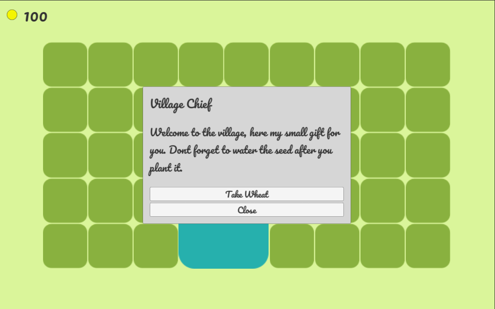

Welcome to the second update of my farming game, lately I start to lose my motivation to continue this game, I still work on the game and push my self to finish it. Writing this blog is also helping me keep working on my games, I am glad start writing this blog actually. And these are the update of the game.

## Sheep

Instead of putting the sheep inside a cage, I decide to let them roam in the field and search for food. This also makes me add weed to the farm, the weed gonna be eaten by sheep, and you need to pull it before planting anything.

## Scenario

For making the game have a bit of a story I add a short narrative into the game to guide the player, give the player and also add a quest for the player to finish.
The story gonna be a pretty common one, the story is you were fired from your work because of a pandemic and you take a loan to work on a farm to pay your loan and start a new life.

## Mail

Mail is used to deliver part of the story and quest to the player.

## UI and Fonts

I want to keep everything minimalist and not much UI, so I decide not to make a sell panel but instead use the inventory UI directly to sell the item.

- UI for plant or build.
- Inventory UI.

## Next Update

- Finish current features.
- Polishing existing features.

---
Thank you 😊 I hope you enjoy it.
