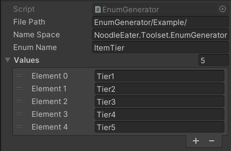

Do you ever think to use enum for making ID because it can be access from code?

for long list of item id this is not good I guess, but for short id this should be fine.

## ScriptableObject

ScriptableObject is used for the user interface of this generator because the user most likely wanna have more than one enum generator they can edit. In this ScriptableObject, we need to define directory, namespace, enum name and values.



## Generator

There are two ways to generate this enum,

1. Create a template file.
2. Using C# CodeDom.

Using CodeDom the generated code will be automatically indented and there should be no error in the indentation or spacing.

This code generator is also can be used for unit testing, but it’s on another level.

For this simple generator, we just need to create, 

- CodeNamespace, represent a namespace declaration.
- CodeTypeDeclaration, this is where we can declare enum, class, interface and struct.
- CodeCompileUnit, a container for the CodeDom program graph or the above variable.

```csharp
private readonly CodeNamespace _codeNamespace = new();
private readonly CodeTypeDeclaration _codeTypeDeclaration = new();
private CodeCompileUnit _codeCompileUnit = new();

public EnumGenerationSystem()
{
    _codeTypeDeclaration.IsEnum = true;
    _codeNamespace.Types.Add(_codeTypeDeclaration);
    _codeCompileUnit.Namespaces.Add(_codeNamespace);
}
```

Use CodeMemberField to add the enum values. CodeMemberField is used to declare a field or type.

```csharp
foreach (var enumValue in Values)
{
    CodeMemberField field = new CodeMemberField(EnumName, enumValue);
    _codeTypeDeclaration.Members.Add(field);
}
```

And finally, write the code into a C# file.

```csharp
CodeDomProvider provider = CodeDomProvider.CreateProvider("CSharp");
CodeGeneratorOptions options = new CodeGeneratorOptions
{
    BracingStyle = "C"
};

using (StreamWriter sourceWriter = new StreamWriter(filePath))
{
    provider.GenerateCodeFromCompileUnit(_codeCompileUnit, sourceWriter, options);
    AssetDatabase.Refresh();
}
```

## Trigger

ContextMenu is used to trigger the user to generate the enum. Not pretty convenient, but at least we can use it now.

```csharp
[ContextMenu("Generate")]
public void GenerateEnum()
{
    EnumGenerationSystem enumGenerationSystem = new EnumGenerationSystem
    {
        Namespace = nameSpace,
        EnumName = enumName,
        FileDirectory = Application.dataPath + "/" + filePath,
        Values = values
    };
    
    enumGenerationSystem.GenerateEnum();
}
```


## Result
Below is the generated enum from the ScriptableObject above.
```csharp
//------------------------------------------------------------------------------
// <auto-generated>
//     This code was generated by a tool.
//     Runtime Version:4.0.30319.42000
//
//     Changes to this file may cause incorrect behavior and will be lost if
//     the code is regenerated.
// </auto-generated>
//------------------------------------------------------------------------------

namespace NoodleEater.Toolset.EnumGenerator
{
    
    
    public enum ItemTier
    {
        
        Tier1,
        
        Tier2,
        
        Tier3,
        
        Tier4,
        
        Tier5,
    }
}
```

You can see the source code [here](https://github.com/noodle-eater/Toolset/tree/master/Assets/EnumGenerator)

---
Thank you 😊 I hope you enjoy it.