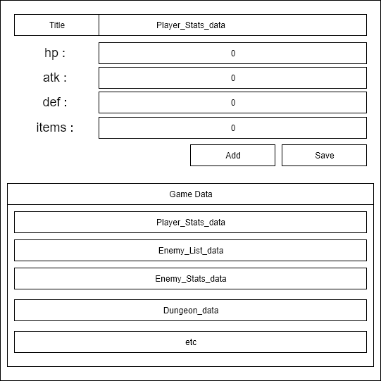

Recently I learn a book about “[Designing the User Experience of Game Development Tools](https://www.crcpress.com/Designing-the-User-Experience-of-Game-Development-Tools/Lightbown/p/book/9781482240191)”, the book is pretty straightforward and easy to understand. As a tools programmer, this is a book that I must read, to make my tools better.

**What is User Experience?**

There are many definitions of user experience. The popular one is from Elizabeth Sanders,

> Tools need to be, "Useful, Usable and Desireable"

**A. Useful**

The tool you make must fulfil user needs, or it will be useless. Ideally, these needs come from users & stakeholders. Before creating your tools, you must know what your user & stakeholder needs, not what they want. You need to separate which one is needs & desire. Otherwise, you will have a bunch of tasks that you need to finish and it will make the development time longer.

Let say that our studio needs a tool to manage data of the game in development. You inspect the developer activities, ask their needs and talk with the stakeholder. And you got this list of user stories.

- As a user, I want to be able to inspect the save data.
- As a user, I want to be able to change the data from the admin panel.
- As a user, I want to export the save data into a different format.
- As a user, I want to manipulate the game saved data.
- As a user, I want to change the save data in runtime.

We need to decide which one will be the needs & desire if you do all at once you will not ship your tools. Not at a short time at least, but your studio need the tools as soon as possible.

After discussion with the tools team, we decide that these are the needs. Why these? First, our tools need to show the user all the save data that the game has, otherwise it will be pointless to add more functionality when they even do not know the data. And we can provide them with functionality to manipulate the data.

- As a user, I want to be able to inspect the save data.
- As a user, I want to manipulate the game saved data.

Why we do not choose these? this feature is awesome but we still do not need it. especially for exporting the data in a different format, I think we must standardize our save data rather that support many formats since it will give a burden when maintaining it in the future. Changing save data from admin panel will be a good feature when our game is live so we can update our game from the admin panel without the need to rebuild the game. But because we are still in the development phase, we can save this for next. Save data in runtime is also a good feature especially for QA so they can easily test the game, but this feature is not needed yet now.

- As a user, I want to be able to change the data from the admin panel.
- As a user, I want to export the save data into a different format.
- As a user, I want to change the save data in runtime.

After a few days working on the main functionality, you finally come up with the basic version of your inspection tool. Now in the sprint review, you can show this and you can proud of it because you make it. And at the end of the sprint, you can ship your product to your user. And waiting for their feedback while improving the current Inspector Tool.

**B. Usable**

There are many definitions of usability, these definitions include a question such as.

* How efficient is it to use?

* How easy is it to learn?

* How well is the user protected from making mistakes?
- How satisfying is it to use?

In my opinion, usability itself is

> Making our tool easy to use by user & reduce the chance of mistakes that happen when using the tool.

After release your Inspector Tool you get some feedback from programmer in your company that use the tool.

- This tool help me inspect the game data & I do not need to print everything
- The game getting error after I update some value
- I got confused, the list below the save button is the list of data?

Our tool already meets the needs of our user but it still not usable yet, we know it from our user feedback. First, we need to analyze the feedback and understand why this is happening.

In the feedback, we know that the user gets some error when updating the value since we are dealing with JSON file. There is a probability the user write wrong JSON syntax. Rather than show all the JSON, we can create some field that will hold the JSON data. And to make use do not confuse with the list of JSON, we can create a box area and give it a title. And we can update our Inspector Tool.

**C. Desireable**

The last aspect that usually feels not important or does not contribute enough to UX. However, a tool that has good aesthetic & appealing design contributes not only to user satisfaction but also will make the user believe that the designer has taken their time to create a high-quality, professional tool and make the user more confidence in using it.

To make our Inspector Tool more desireable, we can change the design of our tool and make it more eye-catching. We can separate our list of data into the left side and the right side for updating the data. Do not forget to add some good UI & colour for the tools.

**Being "More Human"**

The tool you make must resemble interaction with a good friend, and bad tools will make you interact with frustrating people and it will make you piss off.

> Create a tool that can be a good friend for user, so they will use it because they need it. Not because they do not have any choice.

---

Thank you for reading this far :) hope you gain more knowledge.

And have a good day.
